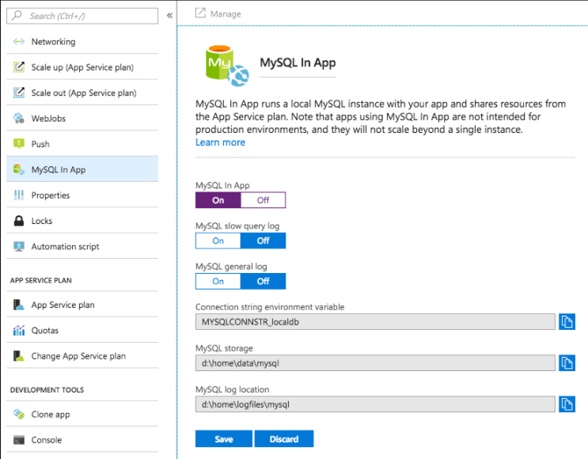

## Azure

# 1. Introdução
O Microsoft Azure agora oferece suporte a Java bastante sólido.

Neste tutorial, vamos demonstrar como fazer nosso aplicativo Spring Boot funcionar na plataforma Azure, passo a passo.

# 2. Dependência e configuração do Maven
Primeiro, precisamos de uma assinatura do Azure para usar os serviços de nuvem lá; atualmente, podemos inscrever uma conta gratuita aqui.

Em seguida, faça login na plataforma e crie uma entidade de serviço usando a CLI do Azure:

```
> az login
To sign in, use a web browser to open the page \
https://microsoft.com/devicelogin and enter the code XXXXXXXX to authenticate.
> az ad sp create-for-rbac --name "app-name" --password "password"
{
    "appId": "aaaaaaaa-aaaa-aaaa-aaaa-aaaaaaaaaaaa",
    "displayName": "app-name",
    "name": "http://app-name",
    "password": "password",
    "tenant": "tttttttt-tttt-tttt-tttt-tttttttttttt"
}
```

Agora, definimos as configurações de autenticação principal de serviço do Azure em nosso Maven settings.xml, com a ajuda da seção a seguir, em <<servers>>:

```
<server>
    <id>azure-auth</id>
    <configuration>
        <client>aaaaaaaa-aaaa-aaaa-aaaa-aaaaaaaaaaaa</client>
        <tenant>tttttttt-tttt-tttt-tttt-tttttttttttt</tenant>
        <key>password</key>
        <environment>AZURE</environment>
    </configuration>
</server>
```

Contaremos com a configuração de autenticação acima ao enviar nosso aplicativo Spring Boot para a plataforma Microsoft, usando azure-webapp-maven-plugin.

Vamos adicionar o seguinte plugin Maven ao pom.xml:

```
<plugin>
    <groupId>com.microsoft.azure</groupId>
    <artifactId>azure-webapp-maven-plugin</artifactId>
    <version>1.1.0</version>
    <configuration>
        <!-- ... -->
    </configuration>
</plugin>
```

Podemos verificar a última versão de lançamento aqui.

Existem várias propriedades configuráveis para este plug-in que serão abordadas na introdução a seguir.

# 3. Implantar um aplicativo Spring Boot no Azure
Agora que configuramos o ambiente, vamos tentar implantar nosso aplicativo Spring Boot no Azure.

Nosso aplicativo responde com “olá azul!” quando acessamos "/hello":

```
@GetMapping("/hello")
public String hello() {
    return "hello azure!";
}
```

A plataforma agora permite a implantação de Java Web App para Tomcat e Jetty. Com o azure-webapp-maven-plugin, podemos implantar nosso aplicativo diretamente em contêineres da web com suporte como o aplicativo padrão (ROOT) ou implantar via FTP.

Observe que, como vamos implementar o aplicativo em contêineres da web, devemos empacotá-lo como um arquivo WAR. Como um lembrete rápido, temos um artigo que apresenta como implantar um Spring Boot WAR no Tomcat.

### 3.1. Implantação de contêiner da web
Usaremos a seguinte configuração para azure-webapp-maven-plugin se pretendemos implantar no Tomcat em uma instância do Windows:

```
<configuration>
    <javaVersion>1.8</javaVersion>
    <javaWebContainer>tomcat 8.5</javaWebContainer>
    <!-- ... -->
</configuration>
```

Para uma instância do Linux, tente a seguinte configuração:

```
<configuration>
    <linuxRuntime>tomcat 8.5-jre8</linuxRuntime>
    <!-- ... -->
</configuration>
```

Não vamos esquecer a autenticação do Azure:

```
<configuration>
    <authentication>
        <serverId>azure-auth</serverId>
    </authentication>
    <appName>spring-azure</appName>
    <resourceGroup>isaccanedo</resourceGroup>
    <!-- ... -->
</configuration>
```

Quando implantamos nosso aplicativo no Azure, vamos vê-lo aparecer como um Serviço de Aplicativo. Portanto, aqui especificamos a propriedade <<appName>> para nomear o Serviço de Aplicativo. Além disso, o Serviço de Aplicativo, como um recurso, precisa ser mantido por um contêiner de grupo de recursos, portanto, <<resourceGroup>> também é necessário.

Agora estamos prontos para puxar o gatilho usando o azure-webapp: implantar o destino Maven e veremos a saída:


```
> mvn clean package azure-webapp:deploy
...
[INFO] Start deploying to Web App spring-isaccanedo...
[INFO] Authenticate with ServerId: azure-auth
[INFO] [Correlation ID: cccccccc-cccc-cccc-cccc-cccccccccccc] \
Instance discovery was successful
[INFO] Target Web App doesn't exist. Creating a new one...
[INFO] Creating App Service Plan 'ServicePlanssssssss-bbbb-0000'...
[INFO] Successfully created App Service Plan.
[INFO] Successfully created Web App.
[INFO] Starting to deploy the war file...
[INFO] Successfully deployed Web App at \
https://spring-isaccanedo.azurewebsites.net
...
```

Agora podemos acessar https://spring-isaccanedo.azurewebsites.net/hello e ver a resposta: 'hello azure!'

Durante o processo de implantação, o Azure criou automaticamente um Plano de Serviço de Aplicativo para nós. Confira o documento oficial para obter detalhes sobre os planos do Serviço de Aplicativo do Azure. Se já temos um plano de serviço de aplicativo, podemos definir a propriedade <<appServicePlanName>> para evitar a criação de um novo:

```
<configuration>
    <!-- ... -->
    <appServicePlanName>ServicePlanssssssss-bbbb-0000</appServicePlanName>
</configuration>
```

### 3.2. Implementação FTP
Para implantar via FTP, podemos usar a configuração:

```
<configuration>
    <authentication>
        <serverId>azure-auth</serverId>
    </authentication>
    <appName>spring-isaccanedo</appName>
    <resourceGroup>isaccanedo</resourceGroup>
    <javaVersion>1.8</javaVersion>

    <deploymentType>ftp</deploymentType>
    <resources>
        <resource>
            <directory>${project.basedir}/target</directory>
            <targetPath>webapps</targetPath>
            <includes>
                <include>*.war</include>
            </includes>
        </resource>
    </resources>
</configuration>
```
    
Na configuração acima, fazemos com que o plug-in localize o arquivo WAR no diretório $ {project.basedir} 
/target e o implemente no diretório webapps do contêiner Tomcat.

Digamos que nosso artefato final seja denominado azure-0.1.war, veremos uma saída como a seguinte assim que iniciarmos a implantação:    
    
```
> mvn clean package azure-webapp:deploy
...
[INFO] Start deploying to Web App spring-isaccanedo...
[INFO] Authenticate with ServerId: azure-auth
[INFO] [Correlation ID: cccccccc-cccc-cccc-cccc-cccccccccccc] \
Instance discovery was successful
[INFO] Target Web App doesn't exist. Creating a new one...
[INFO] Creating App Service Plan 'ServicePlanxxxxxxxx-xxxx-xxxx'...
[INFO] Successfully created App Service Plan.
[INFO] Successfully created Web App.
...
[INFO] Finished uploading directory: \
/xxx/.../target/azure-webapps/spring-isaccanedo --> /site/wwwroot
[INFO] Successfully uploaded files to FTP server: \
xxxx-xxxx-xxx-xxx.ftp.azurewebsites.windows.net
[INFO] Successfully deployed Web App at \
https://spring-isaccanedo.azurewebsites.net 
```
    
Observe que aqui não implantamos nosso aplicativo como o aplicativo da Web padrão para Tomcat, portanto, só podemos acessá-lo por meio de ‘https://spring-isaccanedo.azurewebsites.net/azure-0.1/hello '. O servidor irá responder 'hello azure!' como esperado.

# 4. Implantar com configurações de aplicativo personalizadas
Na maioria das vezes, nosso aplicativo Spring Boot requer acesso a dados para fornecer serviços. O Azure agora oferece suporte a bancos de dados como SQL Server, MySQL e PostgreSQL.

Para fins de simplicidade, usaremos seu MySQL no aplicativo como nossa fonte de dados, pois sua configuração é bastante semelhante a outros serviços de banco de dados do Azure.

### 4.1. Habilitar MySQL no aplicativo no Azure
Como não há uma linha única para criar um aplicativo da web com MySQL no aplicativo habilitado, temos que primeiro criar o aplicativo da web usando a CLI:
    
```
az group create --location japanwest --name isaccanedo-group
az appservice plan create --name isaccanedo-plan --resource-group isaccanedo-group --sku B1
az webapp create --name isaccanedo-webapp --resource-group isaccanedo-group \
  --plan isaccanedo-plan --runtime java|1.8|Tomcat|8.5
```
Em seguida, habilite o MySQL no aplicativo no portal:

   
    
Depois que o MySQL no aplicativo for habilitado, podemos encontrar o banco de dados padrão, a URL da fonte de dados e as informações de conta padrão em um arquivo denominado MYSQLCONNSTR_xxx.txt no diretório /home/data/mysql do sistema de arquivos.

### 4.2. Aplicativo Spring Boot usando o Azure no aplicativo MySQL
Aqui, para necessidades de demonstração, criamos uma entidade de usuário e dois endpoints usados para registrar e listar usuários:
    
```
@PostMapping("/user")
public String register(@RequestParam String name) {
    userRepository.save(userNamed(name));
    return "registered";
}

@GetMapping("/user")
public Iterable<User> userlist() {
    return userRepository.findAll();
}  
```

Vamos usar um banco de dados H2 em nosso ambiente local e alterná-lo para MySQL no Azure. Geralmente, configuramos as propriedades da fonte de dados no arquivo application.properties:
    
```
spring.datasource.url=jdbc:h2:file:~/test
spring.datasource.username=sa
spring.datasource.password= 
```
    
 Enquanto para a implantação do Azure, precisamos configurar azure-webapp-maven-plugin em <<appSettings>>:
 ```
 <configuration>
    <authentication>
        <serverId>azure-auth</serverId>
    </authentication>
    <javaVersion>1.8</javaVersion>
    <resourceGroup>isaccanedo-group</resourceGroup>
    <appName>baeldung-webapp</appName>
    <appServicePlanName>isaccanedo-plan</appServicePlanName>
    <appSettings>
        <property>
            <name>spring.datasource.url</name>
            <value>jdbc:mysql://127.0.0.1:55738/localdb</value>
        </property>
        <property>
            <name>spring.datasource.username</name>
            <value>uuuuuu</value>
        </property>
        <property>
            <name>spring.datasource.password</name>
            <value>pppppp</value>
        </property>
    </appSettings>
</configuration>
```
    
Agora podemos começar a implantar:
```
> mvn clean package azure-webapp:deploy
...
[INFO] Start deploying to Web App custom-webapp...
[INFO] Authenticate with ServerId: azure-auth
[INFO] [Correlation ID: cccccccc-cccc-cccc-cccc-cccccccccccc] \
Instance discovery was successful
[INFO] Updating target Web App...
[INFO] Successfully updated Web App.
[INFO] Starting to deploy the war file...
[INFO] Successfully deployed Web App at \
https://isaccanedo-webapp.azurewebsites.net
```
    
Podemos ver no log que a implantação foi concluída.

Vamos testar nossos novos endpoints:

```
> curl -d "" -X POST https://isaccanedo-webapp.azurewebsites.net/user\?name\=baeldung
registered

> curl https://isaccanedo-webapp.azurewebsites.net/user
[{"id":1,"name":"isaccanedo"}]
```
    
A resposta do servidor diz tudo. Funciona!

# 5. Implante um aplicativo Spring Boot em contêiner no Azure
Nas seções anteriores, mostramos como implantar aplicativos em contêineres de servlet (Tomcat, neste caso). Que tal implantar como um jar executável autônomo?

Por enquanto, podemos precisar colocar em contêiner nosso aplicativo Spring Boot. Especificamente, podemos encaixá-lo e carregar a imagem no Azure.

Já temos um artigo sobre como encaixar um aplicativo Spring Boot, mas estamos prestes a usar outro plugin maven: docker-maven-plugin, para automatizar a dockerização para nós:
 
```
<plugin>
    <groupId>com.spotify</groupId>
    <artifactId>docker-maven-plugin</artifactId>
    <version>1.1.0</version>
    <configuration>
        <!-- ... -->
    </configuration>
</plugin
```

A última versão pode ser encontrada aqui.

### 5.1. Azure Container Registry
Primeiro, precisamos de um Container Registry no Azure para carregar nossa imagem docker.

Então, vamos criar um:
    
```
az acr create --admin-enabled --resource-group isaccanedo-group \
  --location japanwest --name isaccanedoadr --sku Basic
```
    
Também precisaremos das informações de autenticação do Container Registry, e isso pode ser consultado usando:
    
```
> az acr credential show --name isaccanedoadr --query passwords[0]
{
  "additionalProperties": {},
  "name": "password",
  "value": "xxxxxxxxxxxxxxxxxxxxxxxxxxxxxxxx"
}
```
    
Em seguida, adicione a seguinte configuração de autenticação do servidor no settings.xml do Maven:
    
```
<server>
    <id>isaccanedoadr</id>
    <username>isaccanedoadr</username>
    <password>xxxxxxxxxxxxxxxxxxxxxxxxxxxxxxxx</password>
</server>
```
    
### 5.2 Configuração do plugin Maven
Vamos adicionar a seguinte configuração de plug-in Maven ao pom.xml:

```
<properties>
    <!-- ... -->
    <azure.containerRegistry>isaccanedoadr</azure.containerRegistry>
    <docker.image.prefix>${azure.containerRegistry}.azurecr.io</docker.image.prefix>
</properties>

<build>
    <plugins>
        <plugin>
            <groupId>com.spotify</groupId>
            <artifactId>docker-maven-plugin</artifactId>
            <version>1.0.0</version>
            <configuration>
                <imageName>${docker.image.prefix}/${project.artifactId}</imageName>
                <registryUrl>https://${docker.image.prefix}</registryUrl>
                <serverId>${azure.containerRegistry}</serverId>
                <dockerDirectory>docker</dockerDirectory>
                <resources>
                    <resource>
                        <targetPath>/</targetPath>
                        <directory>${project.build.directory}</directory>
                        <include>${project.build.finalName}.jar</include>
                    </resource>
                </resources>
            </configuration>
        </plugin>
        <!-- ... -->
    </plugins>
</build>
```
    
Na configuração acima, especificamos o nome da imagem do docker, a URL do registro e algumas propriedades semelhantes às da implantação do FTP.

Observe que o plug-in usará valores em <dockerDirectory> para localizar o Dockerfile. Colocamos o Dockerfile no diretório docker e seu conteúdo é:
    
```
FROM frolvlad/alpine-oraclejdk8:slim
VOLUME /tmp
ADD azure-0.1.jar app.jar
RUN sh -c 'touch /app.jar'
EXPOSE 8080
ENTRYPOINT [ "sh", "-c", "java -Djava.security.egd=file:/dev/./urandom -jar /app.jar" ]
```
    
### 5.3. Execute o Spring Boot App em uma instância do Docker
Agora podemos construir uma imagem Docker e enviá-la para o registro do Azure:
    
```
> mvn docker:build -DpushImage
...
[INFO] Building image isaccanedoadr.azurecr.io/azure-0.1
...
Successfully built aaaaaaaaaaaa
Successfully tagged isaccanedoadr.azurecr.io/azure-0.1:latest
[INFO] Built isaccanedoadr.azurecr.io/azure-0.1
[INFO] Pushing isaccanedoadr.azurecr.io/azure-0.1
The push refers to repository [isaccanedoadr.azurecr.io/azure-0.1]
...
latest: digest: sha256:0f0f... size: 1375
```
 
Depois que o upload for concluído, verificamos o registro do isaccanedoadr. 
 
Agora estamos prontos para executar uma instância da imagem:
 
Depois que a instância é inicializada, podemos acessar os serviços fornecidos por nosso aplicativo por meio de seu endereço IP público:
 
```
> curl http://a.x.y.z:8080/hello
hello azure!
```

### 5.4 Implantação de Docker Container
Suponha que tenhamos um registro de contêiner, não importa se ele é do Azure, Docker Hub ou nosso registro privado.

Com a ajuda da seguinte configuração do azure-webapp-maven-plugin, também podemos implantar nosso aplicativo da web Spring Boot nos contêineres:

```
<configuration>
    <containerSettings>
        <imageName>${docker.image.prefix}/${project.artifactId}</imageName>
        <registryUrl>https://${docker.image.prefix}</registryUrl>
        <serverId>${azure.containerRegistry}</serverId>
    </containerSettings>
    <!-- ... -->
</configuration>
```

Depois de executar mvn azure-webapp: deploy, o plug-in ajudará a implantar nosso arquivo de aplicativo da web em uma instância da imagem especificada.

Em seguida, podemos acessar os serviços da web por meio do endereço IP da instância ou URL do Serviço de Aplicativo do Azure.

# 6. Conclusão
Neste artigo, apresentamos como implantar um aplicativo Spring Boot no Azure, como um WAR implantável ou um JAR executável em um contêiner. Embora tenhamos abordado a maioria dos recursos do azure-webapp-maven-plugin, existem alguns recursos avançados ainda a serem explorados...

    
 
    
    
